# ECMAScript1

>基本JavaScript

## 原始数据类型

`undefined`、`null`、`Boolean`、`String`、`Number`、`Symbol`

## 引用数据类型

`Function`、`Object`

## 字符串方法汇总

### padStart(number, fill)
补全字符串,第一个参数为补全后的字符串长度,第二个参数为用来补的字符

#### 示例
```js
var date = new Date("2020/04/02");
var year = date.getFullYear();
var month = date.getMonth() + 1;
var day = date.getDate();

var dateStr = `${year}-${month}-${day}`;

console.log(dateStr);//2020-4-2

month = month.toString().padStart(2, "0");
day = day.toString().padStart(2, "0");

var dateStr2 = `${year}-${month}-${day}`;

console.log(dateStr2);//2020-04-02
```

### padEnd(number, fill)
功能大致同padStart,区别是在原字符串的末尾补全

>高级JavaScript

## 预编译
### 全局的代码预编译
1. 创建GO(global object)对象
2. 找变量声明，将变量名作为GO对象的属性名，值为undefined
3. 找函数声明，将函数名作为GO对象的属性名，值为函数体

### 函数体中代码预编译(函数执行时)
1. 创建AO(activation object)对象
2. 找变量声明和形参，将变量名和形参名作为AO对象的属性名，值为undefined
3. 实参值和形参统一，即将实参值赋给形参
4. 找函数声明，将函数名作为AO对象的属性名，值为函数体

## 三种区分一个变量是Object类型还是Array类型的方法
### 1.使用instanceof
```js
var obj = {},
    arr = [];
if (obj instanceof Object) {
	console.log("obj is Object");
}
if (arr instanceof Array) {
	console.log("arr is Array");
}
```
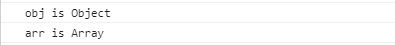
>当变量arr是数组时，使用：arr instanceof Object 语句得到的结果仍然是true

### 2.使用constructor
```js
var obj = {},
    arr = [];
console.log(obj.constructor);
console.log(arr.constructor);
```
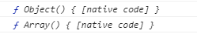
### 3.使用call调用Object的toString()
```js
var obj = {},
    arr = [];
console.log(Object.prototype.toString.call(obj));
console.log(Object.prototype.toString.call(arr));
```
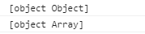


## 闭包的四种用法
### 1.实现公有变量
```js
//累加器
function getCounter() {
	var count = 0;
	return function() {
		count ++;
		return count;
	}
}
var counter = getCounter();
console.log(counter());
console.log(counter());
```
### 2.可以做缓存
```js
function cache() {
	var i = 0;
	return {
		incre: function() {
			return ++i;
		},
		decre: function() {
			return --i;
		}
	}
}
var cache = cache();
console.log(cache.incre());
console.log(cache.decre());
```
### 3.可以实现封装，属性私有化
```js
function Person(name, age) {
	this.name = name;
	this.age = age;
}
var p = new Person('de', 19);
console.log(p.name, p.age);
```
### 4.模块化开发，防止污染全局变量
```js
var initC = (function() {

	var name, age;

	function initContent() {
		//...
	}
	//...

	return function() {
		initContent();
	}

	}())

var initD = (function() {

	var name, age;

	function initContent() {
		//...
	}
	//...

	return function() {
		initContent();
	}

	}())

//程序入口
function init() {
	initC();
	initD();
	//...
}
```


## 数组去重
```js
var arr = [1,2,1,3,1,2,1,1,1,3,3,2,0,0];
Array.prototype.unique = function() {
	var obj = {};
	for (var i=0; i<this.length; i++) {
		obj[this[i]] = this[i];
	}
	var narr = [];
	for (var key in obj) {
		narr.push(key);
	}
	return narr;
}
```


## 深度拷贝
```js
function clone(tar, ori) {
	var origin = ori || {};
	var toStr = Object.prototype.toString;
	for (var key in tar) {
		if (toStr.call(tar[key]) === '[object Array]') {
			origin[key] = [];
			clone(tar[key], origin[key]);
		} else if (toStr.call(tar[key]) === '[object Object]') {
			origin[key] = {};
			clone(tar[key], origin[key]);
		} else {
			origin[key] = tar[key];
		}
	}
	return origin;
}

//举例
var obj = {
	name: 'hh',
	skill: [
		{ name: 'say' },
		{
			name: '11'
		}
	]
}
var nobj = clone(obj);
console.log(nobj.skill[0].name === obj.skill[0].name);
```

### 对象的深度拷贝
使用`JSON.stringify`将对象序列化，然后再使用`JSON.parse`反序列化

## 原型链

### 构造函数

+ 构造函数是一个首字母大写的特殊的`function`

+ 每一个构造函数都有一个`prototype`属性，指向另一个对象

+ 原型是一个对象，也称`prototype`为原型对象，它可以实现方法的共享，节省内存空间

+ 每一个实例都有一个`__proto__`属性，该属性指向构造函数的原型对象

```js
//构造函数首字母大写
function Star(name) {
	this.name = name;

	this.sing = function() {
		console.log("我会唱歌");
	}
}

let ldh = new Star("刘德华");
let zxy = new Star("张学友");

console.log(ldh.sing === zxy.sing);//false,此时两个实例对象ldh和zxy的sing方法分别指向两个不同的引用

Star.prototype.dance = function() {
	console.log("我会跳舞");
}

console.log(ldh.dance === zxy.dance);//true,此时两个实例对象ldh和zxy的dance方法指向同一个引用，因此可以通过将一些共有方法绑定到构造函数的原型上来实现共享，节省内存空间

console.log(ldh.__proto__ === Star.prototype);//true，每个对象都有一个__proto__属性，该属性指向构造函数的原型对象，即prototype
```

构造函数的特点：

 - 构造函数有原型对象`prototype`
 - 构造函数原型对象`prototype`有`constructor`指向构造函数本身
 - 构造函数可以通过原型对象添加方法
 - 构造函数创建的实例对象有`__proto__`指向构造函数的原型对象


### 原型链

上例通过构造函数创建了`Star`对象，又通过`new`关键字实例化了`ldh`对象，`ldh`对象有个`__proto__`属性，该属性也是一个对象，指向构造函数`Star`的原型对象`Star.prototype`，且这个原型对象也有一个`__proto__`属性，指向`Object.prototype`，对应的构造函数就是`Object`，`Object.prototype`也有一个`__proto__`属性，指向`null`

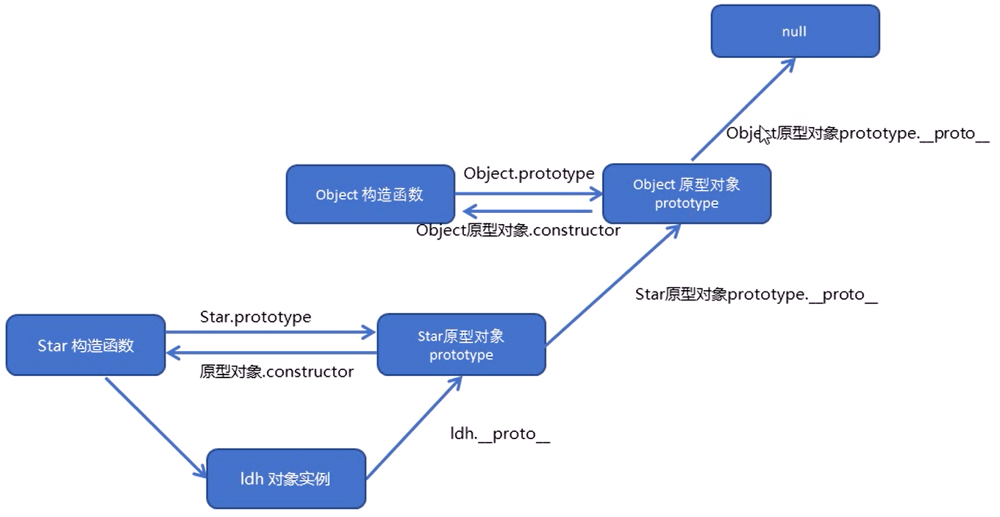

+ 原型对象有一个属性`constructor`指向构造函数：
`Star.prototype.constructor`指向`Star`，`ldh.__proto__.constructor`指向`Star`

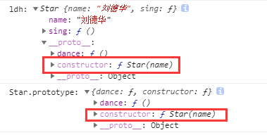

> **注意：**`Object.prototype`是所有对象的最顶层，它的`__proto__`属性指向了`null`

> **ES6之前通过*构造函数*和*原型*实现面向对象编程**


## es5实现继承(圣杯模式)
```js
var inherit = (function() {
	var F = function() {}
	return function(Target, Origin) {
		F.prototype = Origin.prototype;
		Target.prototype = new F();
		Target.prototype.constructor = Target;
		Target.prototype.uber = Origin;
	}
}())

Person.prototype.say = 'person';
function Person(name) {
	this.name = name;
}
function Student(name, grade) {
	Person.call(this, name);
	this.grade = grade;
}

inherit(Student, Person);//Student继承Person

var person = new Person("pp");
var student = new Student("ss", "1");
console.log(student.say);
console.log(person.say);//可以访问到父级的say变量
student.say = 'student';
console.log(student.say);
console.log(person.say);//但是不改变父级的say变量
```


## 函数方法

### call

+ 作用

改变`this`指向

+ 示例

```js
var obj = {
	name: 'lll'
}

function fn(x, y) {
	console.log(this.name + "---" + (x+y));
}

console.log(fn.call(obj, 1, 2));//lll---3
```

+ 应用场景
 - 实现继承

> **注意：**`call`可以传递参数,第一个参数为一个对象，从第二个参数往后的所有参数会当成函数的实参传入

### apply

+ 应用场景
 - 经常做一些跟数组有关的操作，比如利用`Math`对象的方法找出数组元素的最大最小值

### bind

```js
var btn = document.querySelector("button");
btn.onclick = function() {
	this.disabled = true;
	setTimeout(function() {
		this.disabled = false;
	}.bind(this), 3000);
}

//多个按钮绑定点击事件？？？
```

+ 应用场景
 - 只想改变`this`指向，不想调用函数

> **注意：**`call`、`apply`会改变`this`指向，且调用函数，而`bind`只会改变`this`指向并不会调用函数，但是它会返回一个已经改变了`this`指向的函数拷贝


## 数组方法

### forEach
遍历数组，没有返回值

```js
var arr = [1,2,3];
var res = arr.forEach((val, i) => {
	arr[i] = val*2;
	return arr[i];
})

console.log(arr); // [2, 4, 6]
console.log(res); // undefined
```

> **注意：**无法使用`return`、`break`命令中途跳出循环

### map
遍历数组，有返回值，返回一个新数组

```js
var arr = [1,2,3];
var newArr = arr.map((val, i) => {
	return val*2;
})

console.log(arr); // [1, 2, 3]
console.log(newArr); // [2, 4, 6]
```

### filter
遍历数组，有返回值，将满足条件的数组元素放到一个新数组中返回

```js
var arr = [1,2,3];
var newArr = arr.filter((val, i) => {
	return val%2 !== 0;
})

console.log(arr); // [1, 2, 3]
console.log(newArr); // [1, 3]
```

### reduce
对数组中的每一个元素执行特定的操作

```js
//求和数组
var arr = [4, 2, 3];
var c = arr.reduce((c, v, i) => {
  return c+v;
}, 0)

console.log(c);// 9
```

`arr.reduce(callback(accumulator, currentValue[, index[, array]])[, initialValue])`
+ callback: 回调函数
	- accumulator：它是上一次调用回调时返回的累积值，或initialValue
	- currentValue：数组中正在处理的元素
	- index | 可选：数组中正在处理的当前元素的索引。 如果提供了initialValue，则起始索引号为0，否则从索引1起始
	- array | 可选：调用reduce()的数组
+ initialValue | 可选：作为第一次调用 callback函数时的第一个参数的值。 如果没有提供初始值，则将使用数组中的第一个元素。 在没有初始值的空数组上调用 reduce 将报错

- 应用场景
	+ 数组求和
	+ 对象求和
	+ 二维数组转化为一维数组
	+ 计算数组中每个元素出现的次数
	+ 按属性对`object`分类
	+ 数组去重
	+ 按顺序运行`Promise`
	+ 功能性函数管道
	+ 使用`reduce`实现`map`

[详细参见MDN吧，还未完全理解](https://developer.mozilla.org/zh-CN/docs/Web/JavaScript/Reference/Global_Objects/Array/Reduce)

### some
遍历数组，查找数组中是不是至少有一个符合条件的元素，返回值为`Boolean`

```js
var arr = [1, 2, 3];
var flag = arr.some((val, i) => {
  return val === 2;
})

console.log(arr); // [1, 2, 3]
console.log(flag); // true
```

### every
遍历数组，查找数组中所有元素是否符合条件，返回值为`Boolean`

```js
var arr = [4, 2, 3];
var flag = arr.some((val, i) => {
  return val >= 2;
})

console.log(arr); // [4, 2, 3]
console.log(flag); // true
```


> **以上为ES5新增的方法↑**
> **↓以下为ES6新增的方法**

### from
从一个类数组浅拷贝并返回一个数组

### of
创建一个具有可变数量参数的新数组实例，而不考虑参数的数量或类型

```js
Array.of(7);       // [7] 
Array.of(1, 2, 3); // [1, 2, 3]

Array(7);          // [ , , , , , , ]
Array(1, 2, 3);    // [1, 2, 3]
```

> **注意：**`Array.of()`和`Array`构造函数之间的区别在于处理整数参数：`Array.of(7)`创建一个具有单个元素 7 的数组，而`Array(7)`创建一个长度为7的空数组(这是指一个有7个空位(`empty`)的数组，而不是由7个`undefined`组成的数组)

### find
遍历数组，返回数组元素中第一个满足条件的元素

```js
var arr = [4, 2, 3];
var arr1 = arr.find((val, i) => {
  return val >= 2;
})

console.log(arr); // [4, 2, 3]
console.log(arr1); // 4
```

### includes
遍历数组，判断数组中是否包含一个指定的值，返回值为`Boolean`，有两个参数，第一个参数为要查找的值，第二个参数为下标，从该下标开始查找

```js
var arr = [4, 2, 3];
var f1 = arr.includes(2);

console.log(arr); // [4, 2, 3]
console.log(f1); // true

var f2 = arr.includes(2, 2);
console.log(f2); //false
```

> **注意：**数组对象中`from`、`isArray`、`of`为静态方法，直接通过构造函数调用`Array.of`，其他方法为原型对象上定义的，使用数组实例对象调用`[].map`、`new Array().forEach`

### iterator

+ yield
后面跟一个可遍历的结构，它会调用该结构的遍历器接口

### for...of

1. `for...of`循环会自动遍历`Generator`函数运行时生成的`Iterator`对象，且此时不再需要调用`next`方法

2. 遍历的是数组的元素

### for...in

+ 几个缺点：
	1. `for...in`遍历的是数组的下标（字符串数字）或对象的键，且会遍历原型链上所有可枚举的键
	2. 某些情况下，`for...in`会以任意顺序遍历键名
	3. `for...in`主要用来遍历对象而不是数组


## 对象方法

### defineProperty(obj, prop, descriptor)

### assign

用于将所有可枚举属性的值从一个或多个源对象分配到目标对象。它将返回目标对象。

```js
var to = { a: 1 };
var so = { b: 2, c: { d: 3 } };
var res = Object.assign(to, so);
console.log(res); // { a: 1, b: 2, c: { d: 3 } }
console.log(to); // { a: 1, b: 2, c: { d: 3 } }
console.log(so); // { b: 2, c: { d: 3 } }
to.c.d = 4;
console.log(to); // { a: 1, b: 2, c: { d: 4 } }
console.log(so); // { b: 2, c: { d: 4 } }
```

**注意：1. 如果源对象和目标对象都有相同的属性，则源对象覆盖目标对象；2. 无法实现深拷贝。**

### freeze

冻结对象，使其属性无法被增删改

### is

方法判断两个值是否为同一个值。如果满足以下条件则相等：

- 都是 `undefined`
- 都是 `null`
- 都是 `true` 或 `false`
- 都是相同长度的字符串且相同字符按相同顺序排列
- 都是相同对象（意味着每个对象有同一个引用）
- 都是数字且
  - 都是 `+0`
  - 都是 `-0`
  - 都是 `NaN`
  - 或都是非零而且非 `NaN` 且为同一个值

与 `==`、 `===` 的区别：

- `==` 运算符在判断相等前对两边的变量(如果它们不是同一类型) 进行强制转换 (这种行为的结果会将 `"" == false` 判断为 `true`), 而 `Object.is`不会强制转换两边的值；
- 与 `===` 运算也不相同。 `===` 运算符 (也包括 `==` 运算符) 将数字 `-0` 和 `+0` 视为相等 ，而将 `Number.NaN` 与 `NaN` 视为不相等。

## 字符串方法

**ES6新增方法**

### startsWith

### endsWith

### repeat


## strict严格模式

`'use strict'`

严格模式下`this`指向问题：

 - 全局作用域中函数中的`this`指向`undefined`
 - 构造函数不用`new`实例化直接调用，`this`会报错，因为`this`指向`undefined`
 - 使用`new`实例化的`this`还是指向实例对象
 - 定时器`this`还是指向`window`
 - 事件、对象中的`this`还是指向调用者

## Promise

### 基本语法
```js
new Promise((resolve, reject) => {
	if (/* 异步操作成功 */) {
		resolve(resp);
	} else {
		reject(error);
	}
}).then(resp => {
	// 成功回调
}, err => {
	// 失败回调
})
```
构建`Promise`实例时传入`function`作为参数，该函数参数包含两个参数：`resolve`和`reject`，当异步操作成功时自动调用`resolve`，失败时调用`reject`，通过`.then`定义成功和失败的回调函数

上例也可如下写：

```js
new Promise((resolve, reject) => {
	//...
}).then(resp => {
	//...
}).catch(err => {
	//...
})
```

+ `Promise`有三种状态：
	1. `Pending`进行中
	2. `Resolved`已完成，又称`Fulfilled`
	3. `Rejected`已失败


+ 举例：封装`ajax`

```js
function ajax(url) {
	return new Promise((resolve, reject) => {
		var xhr = new XMLHttpRequest();
		xhr.open("GET", url);
		xhr.responseType = "json";
		xhr.send();
		xhr.onreadystatechange = function() {
			if (xhr.readyState == 4 && xhr.status == 200) {
				resolve(this.response);
			}
		};
        xhr.onerror = function() {
          reject();
        }
	})
}

// 调用
ajax("./data.json").then(data => {
	console.log(data);
}).catch(err => {
	console.error(err.message);
})
```

> **注意：**`.then`中的返回也是一个`Promise`对象，如果人为返回一个非`Promise`对象的类型，则会被自动转化为`Promise`对象，且状态为`resolve`
> 如下所示：

```js
Promise.resolve().then(_ => {
  return 12;
}).then(res => {
  console.log(res);// 12
})

//等价于

Promise.resolve().then(_ => {
  return Promise.resolve(12);
}).then(res => {
  console.log(res);// 12
})
```

### Promise.all

用于将多个`Promise`实例包装成一个新的`Promise`实例

+ 基本用法:

`var p = Promise.all([p1, p2, p3]);`

> **说明：**上面代码中，`Promise.all`方法接受一个数组（或类数组）作为参数，`p1`、`p2`、`p3`都是`Promise`对象的实例，如果不是，就会先调用`Promise.resolve`方法将其转为`Promise`实例，再进一步处理。

`p`的状态由`p1`、`p2`、`p3`决定，分两种情况：
1. 只有`p1`、`p2`、`p3`的状态都变成`fulfilled`，`p`的状态才会变成`fulfilled`，此时`p1`、`p2`、`p3`的返回值组成一个数组，传递给`p`的回调函数；
2. 只要`p1`、`p2`、`p3`之中有一个被`rejected`，`p`的状态就变成`rejected`，此时第一个被`rejected`的实例的返回值，会传递给`p`的回调函数

+ 应用举例

```js
var promises = [2, 3, 6].map(id => {
	return ajax("./" + id + ".json");
});

Promise.all(promises).then(datas => {
	//...
}).catch(err => {
	//...
})
```

### Promise.race

`Promise.race`方法同样是将多个`Promise`实例包装成一个新的`Promise`实例

+ 基本用法

`var p = Promise.race([p1, p2, p3]);`

> **说明：**上面代码中，只要`p1`、`p2`、`p3`之中有一个实例率先改变状态，`p`的状态就跟着改变，且该实例的返回值传递给`p`的回调函数。`Promise.race`的参数如果不是`Promise`实例则会调用`Promise.resolve`将其转为`Promise`实例，再进一步处理。

+ 应用举例：请求超时时间

```js
var p = Promise.race([
	ajax("./bigdata.json"),
	new Promise((resolve, reject) => {
		setTimeout(_ => {
			reject(new Error("请求超时"));
		}, 3000);
	})
]);

p.then(res => {
	//...
}).catch(err => {
	//...
})
```

### Promise.resolve

`Promise.resolve`方法的参数分成四种情况：

+ 参数是一个`Promise`对象

如果参数是`Promise`对象，那么`Promise.resolve`不做任何处理，原封不动的返回这个实例

+ 参数是一个`thenable`对象

`Promise.resolve`方法会将这个对象转为`Promise`对象，然后立即执行`thenable`对象的`then`方法

`thenable`对象指的是具有`then`方法的对象，如下：

```js
let thenable = {
	then: function(resolve, reject) {
		resolve(42);
	}
}

let p = Promise.resolve(thenable);
p.then(v => {
	console.log(v);//42
});
```

+ 参数是一个非`thenable`对象，或原始值

`Promise.resolve`方法返回一个`Promise`实例，状态为`Resolved`且返回值为参数值

```js
var p = Promise.resolve("hello promise");

p.then(v => {
	console.log(v);//hello promise
})
```

+ 不带任何参数

`Promise.resolve`方法允许调用时不带参数，直接返回一个`Resolve`状态的`Promise`实例；所以可以使用`Promise.resolve`方法直接创建一个`Promise`实例

```js
var p = Promise.resolve();

//等价于

var p1 = new Promise((resolve, reject) => {
	resolve();
})
```

### Promise.reject

`Promise.reject`方法也会返回一个新的`Promise`实例，该实例状态为`rejected`。它的参数用法与`Promise.resolve`方法完全一致。

```js
var p = Promise.reject();

//等价于

var p1 = new Promise(_, reject => {
	reject();
});
```

### 实现finally

`finally`方法用于指定不管`Promise`对象最后状态如何都会执行的操作；它接受一个回调函数作为参数，该函数不管怎样都会执行。

```js
Promise.prototype.finally = function(callback) {
	let P = this.constructor;
	return this.then(
		val => P.resolve(callback()).then(_ => val),
		err => P.reject(callback()).then(_ => { throw err })
	);
}

//等价于

Promise.prototype.finally = function() {
	let P = this.constructor;
	return this.then(
		val => {
			let p1 = P.resolve(callback()).then(_ => {
				return val;
			})
			return p1;
		},
		err => {
			let p2 = P.reject(callback()).then(_ => {
				throw err;
			})
			return p2;
		}
	);
}
```

### 应用

+ 异步加载图片
```js
const loadImage = function(url) {
	return new Promise((resolve, reject) => {
		var image = new Image();
		image.onload = resolve;
		image.onerror = reject;
		image.src = url;
	});
}
```

## 宏任务与微任务

js任务执行流程


+ 同步任务依次进入主线程执行，异步任务进入`Event Table`
+ 当异步任务指定的事情完成时，`Event Table`会将回调函数注册到`Event Queue`
+ 主线程内的任务执行完之后，会去`Event Queue`读取对应的函数，进入主线程执行
+ 上述过程会不断重复，也就是常说的`Event Loop`(事件循环)

> **js引擎存在`monitoring process`进程，不断的检查主线程执行栈是否为空，一旦为空则去`Event Queue`检查是否有等待被调用的函数**

### 宏任务(Macrotask)

包括：I/O、`setTimeout`、`setInterval`、`requestAnimationFrame`

### 微任务(Microtask)

包括：`MutationObserver`、`Promise.then`、`Promise.catch`

> **任务执行优先级：同步任务 > 微任务 > 宏任务**

+ 举例说明：

```js
//同步任务
console.log(1);

setTimeout(_ => {
	//宏任务
	console.log(2);
}, 0)

Promise.resolve().then(_ => {
	//微任务
	console.log(3);
});

//同步任务
console.log(4);

//控制台输出：
//1
//4
//3
//2
```

## Symbol

## iterator

## Generator函数

+ 基本语法

```js
function* helloGenerator() {
	yield 'hello';
	yield 'generator';
	return 'end';
}

var hg = helloGenerator();
```

+ 特性：
	- `Generator`函数调用后不会立即执行，而是返回一个遍历器对象(或指针对象)；
	- 只有调用`Generator`函数的`next`方法，才会执行，直到遇到下一个`yield`或`return`；
	- `yield`后面的操作只有在调用的时候才会开始执行

+ `yield`与`return`的异同：
	- 都能返回跟在语句后的表达式的值；
	- 执行中每遇到`yield`，函数暂停一下，下一个调用`next`再从该位置继续向后执行，而`return`不具备位置记忆功能；
	- 一个函数里面只能执行一次`return`语句，但是可以执行多次`yield`；
	- 普通函数只能返回一次值，因为只能执行一次`return`，`Generator`函数可以返回一系列值，因为可以有任意多个`yield`

+ 参数
	- 调用`next`方法的时候可以传入参数，作为上次整个`yield`表达式的返回值；
	- `yield`关键字后跟的语句也会有一个执行结果，该结果会封装成一个对象返回给调用`next`方法的地方：`{ value: xxx, done: Boolean }`

有点抽象，举例说明：
```js
function* fn() {
  console.log("start");
  let p1 = yield 1+3;
  console.log("p1:",p1);
  let p2 = yield `${p1} generator`;
  console.log("p2:",p2);
}

let f = fn();
console.log("1:",f.next());
console.log("2:",f.next("world"));
console.log("3:",f.next("haha"));

//f.next()执行
	// start
	// 1: {value: 4, done: false}
//f.next("world")执行
	// p1: world
	// 2: {value: "world generator", done: false}
//f.next("haha")执行
	// p2: haha
	// 3: {value: undefined, done: true}
```
通过上例，
1. 第一次调用`next`时，从函数开头执行，直到遇到`yield`关键字，此时开始执行`yield`关键字后的表达式`1+3`，得到结果`4`封装进对象`value`属性，并将结果`{ value: 4, done: false }`返回给调用`next`的地方；指针停留在此处，不再继续执行；
2. 第二次调用`next`时，传入参数值`world`，该参数值作为第一次执行结束指针指向的`yield`表达式`yield 1+3`的返回值返回，即上例中的`p1`接收到该值；函数继续从上次停住的地方(即上次执行结果指针指向的地方)执行，直到遇到下一个`yield`关键字，此时执行该`yield`之后的语句`${p1} generator`，同样该语句执行结果封装到返回对象`value`属性：`{ value: "world generator", done: false }`返回给调用`next`的地方；指针停留在此处，不再继续执行；
3. 同上，直到函数结尾，此时返回对象中`done`为`true`表示函数执行完成。

> **注意：**`next`方法传入的参数只会作为上次整个`yield`表达式的返回值，看下例

```js
function* foo(x) {
  var y = 2 * (yield (x + 1));
  var z = yield (y / 3);
  return (x + y + z);
}

var a = foo(5);
a.next() // Object{value:6, done:false}
a.next() // Object{value:NaN, done:false}
a.next() // Object{value:NaN, done:true}

var b = foo(5);
b.next() // { value:6, done:false }
b.next(12) // { value:8, done:false }
b.next(13) // { value:42, done:true }
```

上例中，第二次`next`传入的参数`12`只会作为上次`yield`整个表达式`yield (x + 1)`的返回值，因此`y`的值为`2 * 12`等于`24`

## async与await

## Reflect

## Proxy


# DOM

DOM结构树示意图

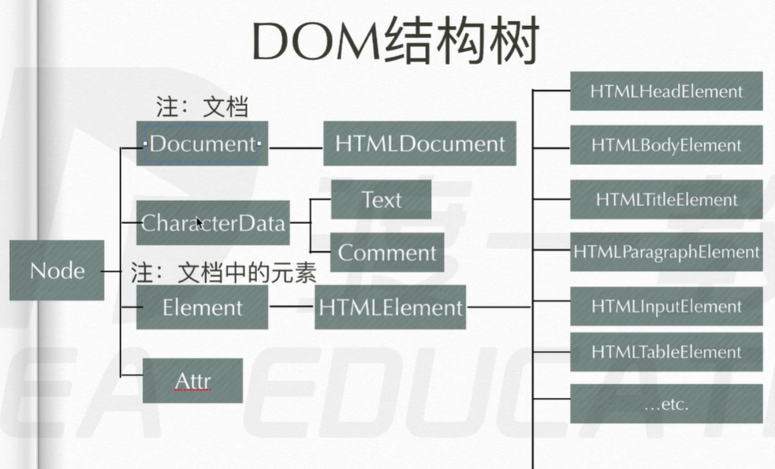


# 事件监听方法

## 封装事件
> addEventListener
> attachEvent
> on+事件类型
```js
function addEvent(elem, type, handle) {
	if (elem.addEventListener) {
		elem.addEventListener(type, handle, false);
	} else if (elem.attachEvent) {
		elem.attachEvent(type, function() {
			handle.call(elem);
		});
	} else {
		elem['on' + type] = handle;
	}
}

var div = document.getElementsByTagName('div')[0];
addEvent(div, 'click', function() {
	console.log(this.innerText);
})
```

## 事件冒泡
> 结构上(非视觉上)嵌套关系的元素，会存在事件冒泡的功能，即同一事件，自子元素冒泡向父元素。(自底向上)

## 事件捕获
> 结构上(非视觉上)嵌套关系的元素，会存在事件捕获的功能，即同一事件，自父元素捕获至子元素(事件源元素)。(自顶向下)

> IE没有捕获事件

> addEventListener函数的最后一位形参为false时，事件冒泡；否则事件捕获。

> 如果同一元素同一事件既绑定了事件冒泡又绑定了事件捕获，则先捕获后冒泡
```xml
// html代码
<div class="wrap">
	<div class="con">
		<div class="box"></div>
	</div>
</div>
```
```js
// js代码
var wrap = document.getElementsByClassName('wrap')[0];
var con = document.getElementsByClassName('con')[0];
var box = document.getElementsByClassName('box')[0];
// 冒泡
wrap.addEventListener('click', function() {
	console.log('wrap 冒泡')
}, false);
con.addEventListener('click', function() {
	console.log('con 冒泡')
}, false);
box.addEventListener('click', function() {
	console.log('box 冒泡')
}, false);

// 捕获
wrap.addEventListener('click', function() {
	console.log('wrap 捕获')
}, true);
con.addEventListener('click', function() {
	console.log('con 捕获')
}, true);
box.addEventListener('click', function() {
	console.log('box 捕获')
}, true);
```
当点击box区域时，执行结果如下：

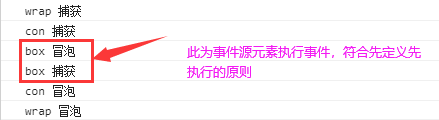

> focus,blur,change,submit,reset,select等事件不冒泡

## 取消事件冒泡
> W3C标准: e.stopPropagation(); 不支持IE9以下版本

> e.cancelBubble = true; 兼容IE, chrome也支持了该方式

## 阻止默认事件
> W3C标准: e.preventDefault(); 不支持IE9以下版本

> return false; 只支持elem.onclick/... = function() {}方式注册的事件

> e.returnValue = false; 兼容IE,chrome也支持了该方式

## 事件委托
利用事件冒泡和事件源对象进行处理

> **原理：**给父节点添加事件监听器，利用事件冒泡影响到每一个子节点

优点：
1. 性能--不需要循环所有的元素一个个绑定事件
2. 灵活--当有新的子元素时不需要重新绑定事件

需求：ul下有10个li，要求给每个li添加点击事件，点击li时打印li中的文本信息
示例：
```html
// html代码
<ul>
	<li>1</li>
	<li>2</li>
	...
</ul>
```
```js
// js代码
var ul = document.getElementsByTagName('ul')[0];
ul.onclick = function(e) {
	var event = e || window.event,
			target = event.target || event.srcElement; // target兼容火狐, srcElement兼容IE
	console.log(target.innerText);
}
```

# 键盘事件
> keydown可以检测所有按键，但是无法区分字母大小写

> keypress只能检测字符按键，且能根据ASCII值区分字母

# 贪吃蛇

[贪吃蛇](demo/snake.html)

# 扫雷

# js异步加载
## defer

`<script src="tools.js" defer='defer'></script>`

或

```js
<script defer='defer'>
	var name = 'kk';
	...	
</script>
```
整个dom文档解析完成之后，才执行；只支持IE

## async

`<script src='tools.js' async='async'></script>`

加载完成就执行，W3C标准

## 动态创建script标签，插入到DOM中，实现按需加载js

```js
function asyncLoadScript(url, callback) {
	var script = document.createElement('script');
	script.type = 'text/javascript';

	if (script.readyState) { // 兼容IE
		script.onreadystatechange = function() {
			if (script.readyState == 'complete' || script.readyState == 'loaded') {
				callback();
			}
		}
	} else { // 其他浏览器，如：chrome,firefox等
		script.onload = function() {
			callback();
		}
	}

	script.src = url; // 此时只下载不执行
	document.head.appendChild(script); // 此时执行
}
```

# js时间线

**1. 创建Document对象，开始解析web页面。解析HTML元素和他们的文本内容后添加Element对象和Text节点到文档中。这个阶段document.readyState = 'loading'。**

**2. 遇到link外部css，创建线程加载，并继续解析文档。**

**3. 遇到script外部js，并且没有设置async、defer，浏览器加载并阻塞，等待js加载完成并执行该脚本，然后继续解析文档。**

**4. 遇到script外部js，并且设置有async、defer，浏览器创建线程加载，并继续解析文档。对于async属性的脚本，脚本加载完成后立即执行。（异步禁止使用document.write()）**

**5. 遇到img等，先正常解析dom结构，然后浏览器异步加载src，并继续解析文档。**

**6. 当文档解析完成，document.readyState = 'interactive'。**

**7. 文档解析完成后，所有设置有defer的脚本会按照顺序执行。（注意与async的不同，但同样禁止使用document.write()）**

**8. document对象触发DOMContentLoaded事件，这也标志着程序执行从同步脚本执行阶段，转化为事件驱动阶段。**

**9. 当所有async的脚本加载完成并执行后、img等加载完成后，document.readyState = 'complete'，window对象触发load事件。**

**10. 从此，以异步响应方式处理用户输入、网络事件等。**

# 正则表达式

## 正向预查&反向预查

### ?=n

匹配字符a并且其后紧跟一个c：`/a(?=c)/`

### ?!n

匹配字符a并且其后紧跟的字符不为c：`/a(?!c)/`

## 量词

### n+

匹配一个或多个a：`/a+/`

匹配一个或多个单词字符：`/\w+/`

### n*

匹配零个或多个a：`/a*/`

匹配零个或多个单词字符：`/\w*/`

### n?

匹配零个或一个a：`/a*/`

匹配零个或一个单词字符：`/\w*/`

### n{x}

匹配3个a：`/a{3}/`

匹配3个单词字符：`/\w{3}/`

### n{x,y}

匹配2-3个a：`/a{2,3}/`

匹配2-3个单词字符：`/\w{2,3}/`

### n{x,}

匹配至少2个a：`/a{2,}/`

匹配至少2个单词字符：`/\w{2,}/`

### n$

匹配结尾为a的字符：`/a$/`

匹配结尾为单词字符的字符：`/\w$/`

### ^n

匹配开头为a的字符：`/^a/`

匹配开头为单词字符的字符：`/^\w/`

匹配以a开头并且以c结尾的字符：`/^a\w*c$/`

## 元字符

### \w

查找单词字符：[a-zA-Z0-9_]

### \W

查找非单词字符

### \d

查找数字：[0-9]

### \D

查找非数字字符

### \s

查找空白字符(空格、换行等)

### \S

查找非空白字符

### \b

查找单词边界
举例：查找a且为单词边界  `/a\b/`, `'abcda'.match(/a\b/) `只会匹配到最后一个字母a

### \B

查找非单词边界

### .

查找单个字符，除了换行和行结束符

## 惰性匹配

> 正则表达式遵循**贪婪匹配**原则，即能多匹配就多匹配，如：`/\d{2,5}/`，该表达式能匹配5个就绝对不会匹配2个
> 但是有的时候**贪婪**并不是一件好事，此时就需要**惰性匹配**，如：`/\d{2,5}?/`，该表达式匹配2个之后就不再匹配了


> `'aa111sd'.match(/(\d)+?/g)`结果为：`["1", "1", "1"]`

> `'aa111sd'.match(/(\d)+/g)`结果为：`["111"]`

### 惰性匹配情况如下

`{m,n}?`

`{m,}?`

`??`

`*?`

`+?`

## 多选分支

1. 匹配"good"和"nice"：`/good|nice/g`
2. 需注意：`"goodbye".match(/good|goodbye/)`结果为：`["good"]`；若改为`"goodbye".match(/goodbye|good/)`结果为：`["goodbye"]`

> **注意：**此为惰性匹配,如：`"#0fbbad".match(/#([0-9a-fA-F]{3}|[0-9a-fA-F]{6})/)`结果为：`["#0fb"]`

## 非捕获分组：`?:`
字符串方法replace中子表达式的运用中介绍到的子表达式可以将当前匹配项捕获到，以便后续引用，因此也称为捕获分组。
除了介绍的一些API中使用，还可以用于自身，如下：
```js
// 匹配日期：yyyy-MM-dd、yyyy/MM/dd、yyyy.MM.dd
var reg = /\d{4}(-|\/|\.)\d{2}\1\d{2}/;
console.log(reg.test('2020-01-09'));
console.log(reg.test('2020/01/09'));
console.log(reg.test('2020.01.09'));
console.log(reg.test('2020-01/09'));
```
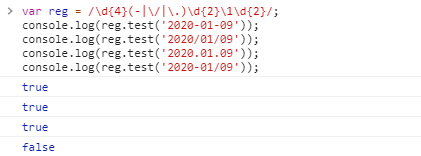

如果只想使用括号最原始的功能，后续也不会引用，此时可以使用非捕获分组，如下：
```js
var reg = /(ab)+/g;
console.log('ababa ab abbaab'.match(reg));
console.log('捕获分组：$1=',RegExp.$1);

var reg = /(?:ab)+/g;
console.log('ababa ab abbaab'.match(reg));
console.log('非捕获分组：$1=',RegExp.$1);
```
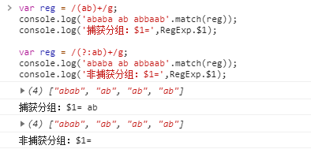

## 字符串方法replace中子表达式的运用

> replace的第二个参数可以是字符串，也可以是函数，当是字符串时：
> `$1,$2...$n` 匹配第1-n里捕获的文本
> `$&` 匹配到的字串文本
> $\` 匹配到的字串文本左边的文本
> `$'` 匹配到的字串文本右边的文本
> `$$` 美元符号

```js
var str = '2,3,4';
var reg = /\d/g;
console.log(str.replace(reg, '$&$&$&'));
console.log(str.replace(reg, '$`'));
console.log(str.replace(reg, "$'"));
```
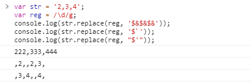

### 正则表达式中用()可以构建子表达式，可以有多个子表达式，如果需要重复使用同一个子表达式，可通过$1,$2...获取，表示第1,2...个子表达式

1. 将the_first_name改为小驼峰式: theFirstName
```js
var reg = /_(\w)/g;
var str = 'the_first_name'.replace(reg, function($, $1) {
	console.log($, $1);
	return $1.toUpperCase();
})
console.log(str);
```
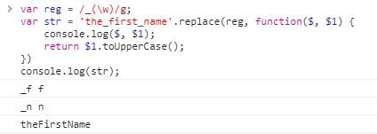

> 如图所示，replace的第二个参数可以是一个回调函数，该函数有多个形参，第一个形参为匹配项，后面的形参为子表达式匹配值；replace会用该函数的返回值作为替换值去替换匹配到的字符

上例，若如下写：
```js
var reg = /_(\w)/g;
var str = 'the_first_name'.replace(reg, function() {
	return RegExp.$1.toUpperCase();
})
console.log(str);
```
运行会发现结果不尽人意：`"theNirstName"`
修改上述问题代码，控制台打印时间戳，看是否每匹配到一次就执行一次回调，若如此则不应出现上述错误
```js
var reg = /_(\w)/g;
var str = 'the_first_name'.replace(reg, function() {
	console.log(new Date().getTime());
	return RegExp.$1.toUpperCase();
})
console.log(str);
```
运行结果如下：

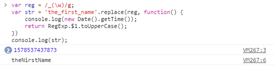

由此可见，匹配到几次就会执行几次回调函数，但是执行时间是在所有匹配结束之后统一回调的。

## 字符串方法split注意项

### 可以有第二个参数，表示结果数组的最大长度
```js
var str = 'html,css,javascript';
var arr = str.split(/,/, 2);
console.log(arr);
```
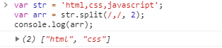

### 结果数组中可以包含分隔符
```js
var str = 'html,css,javascript';
var arr = str.split(/(,)/);
console.log(arr);
```
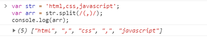

## 实战

### 1. 将100000000000改为100.000.000.000, 即从最后一位数字开始, 每倒数三位用 . 分隔
```js
var reg = /(\B)(?=((\d){3})+$)/g;

var str = '100000000000'.replace(reg, '.');
console.log(str);
```


> `/(?!^)(?=((\d){3})+$)/g`也可以实现上述功能

### 2. 匹配24进制时间：`/^([01][0-9]|[2][0-3]):[0-5][0-9]$/`

### 3. 同上，区别是02:02可以是2:2：`^(0?[0-9]|1[0-9]|2[0-3]):(0?[0-9]|[1-5][0-9])$`

### 4. 匹配日期：`/^\d{4}-(0?[1-9]|1[0-2])-(0?[1-9]|[12][0-9]|3[01])$/`

### 5. 密码校验：1.6位，2.由数字和大小写字母组成，3.至少含有数字和小写字母
```js
// 至少含有数字和小写字母
/((?=.*[0-9])(?=.*[a-z]))^[0-9a-zA-Z]{6}$/g

// 至少含有两种字符，方式一
/((?=.*[0-9])(?=.*[a-z])|(?=.*[0-9])(?=.*[A-Z])|(?=.*[a-z])(?=.*[A-Z]))^[0-9A-Za-z]{6,12}$/

// 至少含有两种字符，方式二
/(?!^[0-9]{6,12}$)(?!^[a-z]{6,12}$)(?!^[A-Z]{6,12}$)^[0-9A-Za-z]{6,12}$/
```

# CSS

## 盒子模型

+ 包括：`content`(内容区)、`padding`(内边距)、`border`(边框)、`margin`(外边距)
+ 一般浏览器`content`不包含`padding`和`border`，但`IE`不然
+ 可以使用`box-sizing: border-box;`设置为`content`包含`padding`和`border`

## 元素分类

+ 块级元素：`ul`、`ol`、`li`、`dl`、`dd`、`h1-6`、`p`、`section`、`div`、`form`、`address`、`center`(居中)、`hr`、`pre`(预格式化)、`blockquote`(文本缩进)、`marquee`(文本滚动)、`table`
+ 行内元素：`a`、`b`(加粗)、`span`、`img`、`input`、`select`、`textarea`、`em`(斜体)、`strong`、`br`、`sup`()上标、`sub`(下标)、`i`(斜体)、`del`(删除线)、`u`(下划线)


## 居中

```css
/*1.设置父元素弹性布局*/
div {
	display:flex;
	justify-content: center;
	align-items: center;
}
```
[点我看效果](./弹性布局居中.html)

```css
/*2*/
div {
	position: absolute;
	width: 200px;
	height: 200px;
	left: 50%;
	top: 50%;
	margin-left: -100px;
	margin-top: -100px;
}
```
```css
/*3*/
div {
	position: absolute;
	width: 200px;
	height: 200px;
	left: 50%;
	top: 50%;
	transform: translate(-50%, -50%);
}
```
```css
/*4*/
div {
	position: absolute;
	width: 200px;
	height: 200px;
	left: 0;
	top: 0;
	right: 0;
	bottom: 0;
	margin: auto;
}
```

## css获取容器宽高的方式

1. el.offsetWidth = width + 左右padding + 左右border
2. el.clientWidth = width + 左右padding
3. el.scrollWidth = 实际高度(可视区高度+隐藏区高度)，包括padding但不包含border

## chrome等浏览器表单提交记住密码后，下次自动填充表单的背景会变成黄色，修改方法

```
//方法1
input:-webkit-autofill, textarea:-webkit-autofill, select:-webkit-autofill {
  background-color: #fff;//设置成元素原本的颜色
  background-image: none;
  color: rgb(0, 0, 0);
}
//方法2
input:-webkit-autofill {
    -webkit-box-shadow: 0px 0 3px 100px #ccc inset; //背景色
}
```

## 变形动画
1. `transform:translateX(100px) translateY(100px) translateZ(100px) translate(10px, 10px) translate3d(10px, 20px, 20px);`平移,Z轴不能使用百分数
2. `transform:rotateX(45deg) rotate(45deg, 90deg) rotate3d(90deg, 20deg, 30deg);`旋转
3. `transform:scaleX(.5) scale(.5, 2) scale3d(.5, 2, 1.5);`缩放
4. `transform:skewX(45deg) skew(45deg, 60deg);`倾斜
5. `transform-origin:left top 100px;`参考点
6. `backface-visiability:visible/hidden;`旋转后背面是否可见,需父级设置`transform-style: preserve-3d`
7. `transform-style:preserve-3d;`3d效果
8. `background:linear-gradient(45deg, red, green 50%, blue 30%);`背景颜色线性渐变
9. `background:radial-gradient(45deg, red, green, blue);`径向渐变

## 过渡效果
1. `transition-property: background,width/all/none;`需要过渡的属性
2. `transition-duration: 2s/1s, 200ms;`过渡时间,当设置的过渡属性个数多于过渡时间个数时,第一个属性匹配第一个时间,依次类推;当匹配到最后一个时间时,剩余属性再次从第一个时间开始匹配,依次循环匹配,直至最后属性。
3. `transition-timing-function: ease/ease-in/ease-out/ease-in-out/linear/cubic-bezier(n,n,n,n);`设置过渡效果
4. `transition-delay: 1s;`可设置多值,当设置的过渡属性个数多于该属性个数时,匹配规则同`transition-duration`
5. `transition: all linear 2s 1s;`依次为：过渡属性 过渡效果 过渡时间 过渡延时,可设多值：`width ease 2s 200ms, background linear 1s 1s`;

## 动画
1. `animation-name: xx,yy;`动画名称,可设置多个
2. `animation-duration: 2s,3s;`动画时间,当动画设置个数多于动画时间时,匹配规则同`transition-duration`
3. `animation-iteration-count: 1;`动画执行次数,可设置动画个数多于该设置时,匹配规则同`transition-duration`;另该值为:`infinite`时动画执行无限次
4. `animation-direction: normal/reverse/alternate/alternate-reverse;`动画方向,始于第一帧(或最后一帧),停止于初始帧,如果执行次数(`animation-iteration-count`)等于1,从第一帧(或最后一帧)平滑过渡到最后一帧(或第一帧),然后跳回初始帧;如果执行次数(`animation-iteration-count`)大于等于2,则有多种情况->`normal`:从第一帧平滑过渡到最后一帧,然后跳回第一帧再平滑过渡到最后一帧,依此循环执行,直至结束停在初始帧;`alternate`:从第一帧平滑过渡到最后一帧,然后从最后一帧平滑过渡到第一帧,再从第一帧平滑过渡到最后一帧,依此循环执行,直至结束停在初始帧;`reverse`:从最后一帧平滑过渡到第一帧,然后跳回最后一帧再次平滑过渡到第一帧,依此循环执行,直至动画结束停在初始帧;`alternate-reverse`:从最后一帧平滑过渡到第一帧,然后从第一帧平滑过渡到最后一帧,再从最后一帧平滑过渡到第一帧,依此循环执行直至动画结束停在初始帧;具体效果参考:[animation-direction案例](demo/animation-direction.html)。
5. `animation-delay: 2s;`动画延时执行
6. `animation-fill-mode: none/forwards/backwards/both;`设置动画执行前后的状态,`none`:始于第一帧,终于初始帧;`forwards`:始于第一帧,终于最后帧;`backwards`:始于第一帧,终于初始帧(不是第一帧);`both`:始于第一帧,终于最后一帧;默认始于初始帧,终于初始帧;具体效果参考:[animation-fill-mode案例](demo/animation-fill-mode.html)。
7. `animation-play-state: running/paused;`动画状态运行or暂停
8. `animation-timing-function:ease/ease-in/ease-out/ease-in-out/linear/steps;`动画执行节奏,始于第一帧,停止于初始帧;`ease`(默认):从第一帧开始,逐渐加速然后减速终于最后一帧,停止于初始帧;`ease-in`:从第一帧开始,前一半时间慢速移动,后一半时间快速移动终于最后一帧,停止于初始帧;`ease-out`:从第一帧开始,前一半时间快速移动,后一半时间慢速移动终于最后一帧,停止于初始帧;`ease-in-out`:从第一帧开始,两头慢速移动,中间快速移动终于最后一帧,停止于初始帧;`linear`:从第一帧开始匀速移动终于最后一帧,停止于初始帧;`step-start`:开始时直接从第一帧跳到最后一帧等待动画结束,停止于初始帧,如果动画执行多次,则第一次执行跳到最后一帧后不再动,直至动画执行结束停止于初始帧,等同于`steps(1,start);step-end`:动画执行一次时,动画执行结束的最后一刻直接跳到最后一帧,停止于初始帧,如果动画执行多次,则一直不动,等同于`steps(1,end);steps(n,start)`:n>=2,第一帧和最后一帧之间分n等份执行,停止于初始帧;`steps(n,end)`:第一帧和最后一帧之间分n等份,在第一帧与n-1帧之间执行,开始时等待(执行时间/n)s,然后开始执行,停止于初始帧;也可使用贝塞尔曲线：`cubic-bezier(n,n,n,n)`,自定义[贝塞尔曲线](https://cubic-bezier.com);具体效果参考:[animation-timing-function案例](demo/animation-timing-function.html)。
9. `@keyframes xx { 25% {...} 50% {...} ...}`定义动画

## 弹性布局
1. `display:flex;`弹性盒模型
2. `flex-wrap:nowrap/wrap/wrap-reverse;`子元素超出父元素时的显示,`warp`换行或换列显示;`nowrap`不换行/列(默认);`wrap-reverse`反向换行/列
3. `flex-direction:row/row-reverse/column/column-reverse;`布局方向,`column`按列,`row`按行
4. `flex-flow:column wrap;`2,3综合体
5. `justify-content: flex-start/flex-end/center/space-between/space-around/space-evenly;`主轴排列方式
6. `align-items: stretch(默认)/center/flex-start/flex-end;`交叉轴排列方式
7. `align-content: stretch/flex-start/flex-end/center/space-between/space-around/space-evenly;`只适用于多行显示的弹性容器，它的作用是当flex容器在交叉轴上有多余的空间时，对元素的对齐处理
8. `align-self:stretch/flex-start/flex-end/center;`控制单个元素在交叉轴上的排列方式
9. `flex-grow:1;`将弹性盒子的可用空间，分配给弹性元素。可以使用整数或小数声明
10. `flex-shrink: 2;`弹性盒子装不下元素时定义的缩小值
11. `flex-basis: 100px;`分配多余空间之前，项目占据的主轴空间,优先级`width/height < flex-basis < min/max-width/height`
12. `flex:1 0 100px;`9、10、11综合体
13. `order: 1;`控制弹性元素的排序,数值越小越在前面，可以负数或整数

## 栅格系统
1. `display:grid/inline-grid;`设置元素为块级/行级栅格容器
2. `grid-template-rows:100px 100px;`划分行,有`100px 100px、50% 50%、repeat(2, 50%)、repeat(2, 1fr)、repeat(2, 100px)`等多种写法
3. `grid-template-columns:25% 25% 25% 25%;`划分列,写法同上
4. `row-grap: 20px;`设置行间距
5. `column-grap: 30px;`设置列间距
6. `grap: 20px 30px;`4,5组合


## 将iconfont图标以Unicode的方式引入项目
1. 将图标添加到购物车

# vue

## 过滤器filter

### 全局过滤器
```js
Vue.filter(filter_name, function(value) {
	return value + "11";
});
```
调用：
```html
<div>{{ name | filter_name }}</div>
```

#### 可传参
```js
Vue.filter(filter_name, function(value, args1, args2) {});
```
```html
<div>{{ name | filter_name('args1', 'args2') }}</div>
```

#### 可同时使用多个过滤器
```html
<div>{{ name | filter_name | filter_name }}</div>
```
前一个过滤器的返回值会做为后一个过滤器的第一个参数值传入

**注意：**过滤器只能用于：双花括号插值和`v-bind`表达式

## 自定义指令directive

### 全局指令
```js
Vue.directive(directive_name, {
	bind() {},								//只调用一次,指令第一次绑定到元素时;一般样式操作写这
	inserted() {},						//被绑定元素插入父节点时调用;js行为写这
	update() {},              //所在组件更新时调用
	componentUpdated() {},		//所在组件VNode及其子VNodes全部更新时调用
	unbind() {}								//只调用一次,指令与元素解绑时
})
```
第一个参数为指令名称,**注意：**指令在调用时,必须加`v-`前缀
第二个参数是一个对象,包含各个阶段的钩子函数
钩子函数第一个参数为绑定指令的元素,第二个参数为一个对象,对象有以下属性：

1. `name`:指令名
2. `value`:指令的绑定值
3. `oldValue`:旧值
4. `expression`:字符串形式的指令表达式
5. `arg`:传给指令的参数，可选。例如 `v-my-directive:foo` 中，参数为 `"foo"`
6. `modifiers`:一个包含修饰符的对象。例如：`v-my-directive.foo.bar` 中，修饰符对象为 `{ foo: true, bar: true }`

### 私有指令
```js
new Vue({
	el: '#app',
	data:...
	methods:...
	directives: {
		directive_name: {
			bind() {},
			//...
		},
		directive_name2://...可以定义多个
	}
});
```
### 简写
如果指令只用到`bind`和`update`,则可：
```js
directives: {
	directive_name: function(el, binding) {
		//...
	}
}
```
以上相当于把代码写到`bind`和`update`钩子函数中

## 定义子组件

### 方式一

```js
Vue.component('child-one', {			// 子组件名称也可为驼峰式:childOne, html代码调用还是<child-one>
	template: '<h1>{{name}}</h1>',
	data () {
		return {
			name: 'liuh'
		}
	},
	props: {
		age: {
			type: Number
		}
	}
})
```
使用
```html
<child-one :age='12'></child-one>
```

### 方式二

```js
//定义组件模板
<script type="text/x-component" id='contentOne'>
  <h1>{{name}}-{{age}}</h1>
</script>
```
```js
//定义组件
Vue.component('childOne', {
  template: '#contentOne',
  data () {
    return {
      name: 'liuh'
    }
  },
  props: {
    age: {
      type: Number
    }
  }
    
})
```
使用
```html
<child-one :age='12'></child-one>
```
> 使用`Vue.component`定义的组件为全局组件

### 方式三<私有组件>

```js
//组件模板同方式二
//定义组件对象
var childOne = {
  template: '#contentOne',
  data () {
    return {
      name: 'liuh'
    }
  },
  props: {
    age: {
      type: Number
    }
  }
}

//使用此方式定义的组件，需要如下引用
new Vue({
  el: '#app',
  components: {childOne}, //此处引用子组件
  data: {
    m: 'hello'
  }
});
```

### 组件模板的定义

#### 使用script标签
上述例子就是使用`script`标签定义的组件模板，此处不再赘述

#### 使用template标签
```
<template id="contentOne">
	//模板代码
</template>
```

## 父子组件通信

### 使用$emit

```js
// 当子组件发生某些操作时,通过$emit方法,触发监听事件,然后调用父组件的方法对父组件进行操作
// 子组件
this.$emit('calc');
```
```html
<child-one :good-list="goods" @calc='calcPrice()'></child-one>
```
上述，`calcPrice`为父组件方法

详细见:[父子组件通信之$emit](demo/vue-$emit.html)

### 使用sync

```html
<child-one :good-list.sync="goods"></child-one>
```
> **注意：**`goods`为引用变量,sync关键字对普通变量无效

详见:[父子组件通信之sync](demo/vue-sync.html)

## 内容分发之slot

俗称：插槽

### 使用场景
当同一组数据展现的方式不相同时，可以使用插槽

### slot使用

#### 2.6.0以下版本

```html
// 子组件
<div id='child'>
	<slot name="header"></slot> //具名插槽
	<slot></slot>
	<slot name="footer"></slot>
</div>

// 父组件
<div id='parent'>
	<h3 slot='header'>header</h3>
	<main>main</main>
	<div slot='footer'>footer</div>
</div>

// 渲染后
<div id='child'>
	<h3>header</h3>
	<main>main</main>
	<div>footer</div>
</div>
```

#### 2.6.0版本

> `v-slot`一般情况下只能添加在`<template>`上

```html
// 子组件
<div id='child'>
	<slot name="header"></slot> //具名插槽
	<slot></slot>
	<slot name="footer"></slot>
</div>

// 父组件
<div id='parent'>
	<template v-slot:header>
		<h3>header</h3>
	</template>
	<main>main</main>
	<template v-slot:footer>
		<div>footer</div>
	</template>
</div>

// 渲染后
<div id='child'>
	<h3>header</h3>
	<main>main</main>
	<div>footer</div>
</div>
```

### 作用域插槽
父组件使用子组件数据

#### 2.6.0以下版本

```html
// 子组件,其中list为子组件作用域下定义的变量
<div id='child'>
	<slot name="slot1" :list="list"></slot>
</div>

// 父组件
<div id='parent'>
	<ul slot="slot1" slot-scope="props">
		<li v-for="item in props.list">{{ item }}</li>
	</ul>
</div>
```

#### 2.6.0版本

```html
// 子组件,其中list为子组件作用域下定义的变量
<div id='child'>
	<slot name="slot1" :list="list"></slot>
</div>

// 父组件
<div id='parent'>
	<ul v-slot:slot1="props">
		<li v-for="item in props.list">{{ item }}</li>
	</ul>
</div>
```

#### 具名插槽缩写
`v-slot:`简写为`#`, 如：`<template v-slot:slot1='props'></template>`可简写为：`<template #slot1='props'></template>`

## 动态组件之is

`<component :is="type"></component>`

当`type`的取值变化时，显示对应的子组件

> 可以不使用`template`标签，使用`div`等标签也可以达到效果

### keep-alive
正常情况下，动态组件之间切换时会重新加载组件实例，如果希望组件实例在第一次创建的时候缓存下来，则可以使用`<keep-alive>`标签将动态标签包裹起来

### 动态组件添加动画效果
动态组件之间切换的时候也可以通过`<transition>`添加过渡动画
```html
<div id="app">
  <a href="" @click.prevent="type='login'">登录</a>
  <a href="" @click.prevent="type='register'">注册</a>
  <transition mode="out-in">
    <component :is="type"></component>
  </transition>
</div>
```
```css
.v-enter, .v-leave-to {
  opacity: 0;
  transform: translateX(150px);
}
.v-enter-active, .v-leave-active {
  transition: all 1s ease;
}
```
其中，属性`mode`为过渡模式：
1. `out-in`:当前元素先过渡离开，完成之后新元素再过渡进入
2. `in-out`:新元素先过渡进入，完成之后当前元素再过渡离开

## 过渡&动画

### transition-group
当需要给`v-for`循环的元素动画时，使用`transition-group`

```
<div id="app">
  <button @click="add">add</button>
  <ul>
    <transition-group>
      <li v-for="name in person" :key="name">
        {{ name }}
      </li>
    </transition-group>
  </ul>
</div>

new Vue({
  el: '#app',
  data: {
    person: ['落樱', '高山', '流水']
  },
  methods: {
    add() {
      this.person.push('小草');
    }
  }
});
```
```css
.v-enter, .v-leave-to {
  opacity: 0;
  transform: translateY(80px);
}
.v-enter-active, .v-leave-active {
  transition: all 1s ease;
}
```

### appear属性
页面初始化时的入场动画

### tag属性
没有该属性时，`transition-group`会被渲染为`span`标签，如果不想被渲染为`span`标签，则使用`tag`属性指定想要被渲染为的标签元素，如：`<transition-group tag="ul">`

### 动态组件和路由都可以添加动画
```
<transition>
	<router-view></router-view>>
</transition>
```

## 自定义指令

## $refs属性
当需要获取dom元素时，可以使用`ref`
```
<div ref="myDiv">我是一个div</div>

this.$refs.myDiv.innerText; //我是一个div
```
`ref`属性也可以使用在组件身上
```
<my-component ref="myc"></my-component>

this.$refs.myc.name; //name是组件my-component的数据(定义在组件data)
this.$refs.myc.func(); //func是组件my-component的方法(定义在组件methods)
```

## watch侦听器
`watch`可以监听`data`中定义的变量，如果被监听的变量值发生变化，则会触发相应的方法，该方法有两个参数：第一个参数为新值，第二个参数为旧值
```js
new Vue({
  el: '#app',
  data: {
    firstName: '',
    lastName: '',
    fullName: ''
  },
  watch: {
    firstName(newVal) {
      this.fullName = newVal + '-' + this.lastName;
    },
    lastName: function(newVal) {
      this.fullName = this.firstName + '-' + newVal;
    }
  }
});
```

## computed计算属性
`computed`计算属性是一个`function`，该`function`内部会用到`data`中的变量，当这些变量值发生变化时，会触发计算属性（即计算属性定义时的`function`执行）重新计算该属性的值

**注意：**
1. 计算属性可以当成一个`data`中的变量调用
2. 计算属性有缓存机制，若其用到的变量的值没有发生变化，则不会再次计算
```js
new Vue({
  el: '#app',
  data: {
    firstName: '',
    lastName: ''
  },
  computed: {
    fullName: function() {
      return this.firstName + '-' + this.lastName;
    }
    //简写
    //fullName() {
    //  return this.firstName + '-' + this.lastName;
    //}
  }
});
```

## MVVM响应式原理

### 原理图

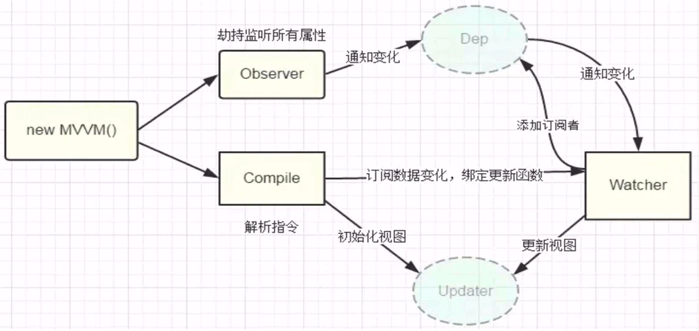

### 实现

## 路由之vue-router

```js
// 定义两个组件：hello liuh
const hello = {
  template: '<h3>hello</h3>'
};
const liuh = {
  template: '<div>liuh</div>'
};

// 定义路由
let routes = [
  { path: '/hello', component: hello },
  { path: '/liuh', component: liuh }
];
let router = new VueRouter({
  routes
});

// 路由引入
new Vue({
  el: '#app',
  router
});
```
```html
<div id="app">
  <router-link to="/hello">hello</router-link>
  <router-link to="/liuh">liuh</router-link>
  <router-view></router-view>
</div>
```

### vue-router之参数传递

`:id`

```js
let routes = [
  { path: '/hello/:id', component: hello },
  { path: '/liuh', component: liuh }
];
```

```js
const hello = {
  template: '<div><h3>hello{{$route.params.id}}</h3><button @click="show">参数</button></div>',
  methods: {
    show () {
      console.log(this.$route.params.id)
    }
  }
};
```
在html代码中使用:`{{$route.params.id}}`
在js代码中使用:`this.$route.params.id`

多个参数时`...path: '/hello/:id/:name'...`

### vue-router之参数类型限制

`:id(\\d{2})`

配合正则表达式限制传递参数的类型

`{ path: '/hello/:id(\\d{2})/:name', component: hello },`

### 重定向redirect

```js
{ path: '/about', redirect: { name: 'content', params: { id: 3 } } }
```

点击路由:`about`时,会自动重定向到:`content/3`

### 别名alias

`path: '/content/2', alias: ['/ct2']`

路由`/ct2`时,将跳转到`/content/2`

### 命名视图
```html
<div id="app">
  <router-view></router-view>
  <router-view name="left"></router-view>
  <router-view name="main"></router-view>
</div>
```
```js
var header = {
  template: '<h3>header<h3>'
}

var leftBox = {
  template: '<div>left</div>'
}

var mainBox = {
  template: '<div>main</div>'
}

var router = new VueRouter({
  routes: [
    { path: '/', components: {
      default: header,
      left: leftBox,
      main: mainBox
    } }
  ]
});

new Vue({
  el: '#app',
  router
});
```


## vue状态管理之vuex

### vuex之state

```js
let store = new Vuex.Store({
	state: {
		name: 'liuh'
	}
});

new Vue({
	el: '#app',
	store
});
```

引用：`this.$store.state.name`

### vuex之getters

### vuex之mutations

### vuex之actions

### vuex之modules


## nrm

### 安装
`npm i nrm -g`

### 作用
管理npm镜像，可以自由在各种镜像之间切换

### 查看当前镜像
`nrm ls`列表中前面带 “\*” 号为当前使用

### 切换
`nrm use taobao`切换到淘宝镜像


# webpack

## 安装

全局安装

`npm install webpack -g`

`npm i webpack -g`	--简写

局部安装

`npm install webpack --save-dev`

`npm i webpack -D`   --简写

`npm i webpack-cli -D`

## 项目初始化

`npm init -y`

## 编译单个文件

`npx webpack ./src/main.js -o ./dist/boundle.js`

文件`main.js`将被编译打包到`dist/boundle.js`

## webpack-dev-server

项目自动打包编译工具

+ 安装

`npm i webpack-dev-server -D`

由于是局部安装，故无法直接执行相应指令进行打包，需要在`package.json`文件中添加配置项: 

```json
"scripts": {
  "dev": "webpack-dev-server"
}
```

+ 一些配置  
	1. `hot`热重载
	2. `port`设置端口
	3. `contentBase`项目启动后打开页面的根目录，若不设置默认打开项目安装目录下index.html
	4. `open`启动后自动打开浏览器

	- 方式一：直接在启动命令添加

		`webpack-dev-server --open --port 8008 --hot --contentBase ../`

	- 方式二：在webpack配置文件`webpack.config.js`中添加配置

```js
devServer: {
  open: true, //自动打开浏览器
  port: 3000, //启动端口
  contentBase: './',  //启动项目的根目录，启动时默认打开当前目录下的index.html
  hot: true //是否开启热重载，当开启时，还需要引入热重载插件
}
```

> **注意：**其中，`hot: true`只开启了热重载开关，若要实现真正的功能还需引入热重载插件，该插件为webpack自带

```js
const webpack = require("webpack")

plugins: [
  new webpack.HotModuleReplacementPlugin()
]
```

## html-webpack-plugin

根据指定的模板html页面自动生成页面，写入内存；且将编译后的脚本文件使用`script`标签导入该页面。

+ 安装

`npm i html-webpack-plugin -D`

+ 配置

```js
const HtmlWebpackPlugin = require('html-webpack-plugin')

plugins: [
  new HtmlWebpackPlugin({
    template: path.join(__dirname, './index.html'),//作为模板的html文件路径
    filename: 'index.html' //生成到内存中的文件名称
  })
]
```

+ 参数

	- template：作为模板的html文件路径
	- filename：生成到内存中的文件名称
	- title：生成的html页面title

> 详见:[htmlWebpackPlugin插件参数](https://github.com/jantimon/html-webpack-plugin#configuration)

## css-loader与style-loader

webpack只能编译`.js`文件，如果项目中引入`.css`文件(如：`import './css/index.css'`)，则需要安装`style-loader`和`css-loader`

+ 安装

`npm i style-loader css-loader -D`

+ 配置

webpack配置文件的`module`>`rules`节点添加一个规则:

```js
module: {
  rules: [
    { test: /\.css$/, use: ['style-loader', 'css-loader'] }
  ]
}
```

> **注意：**规则配置的loader从右向左调用

## less-loader与sass-loader

处理`.less`类型的样式文件

+ 安装

`npm i less less-loader -D`

+ 配置

```js
module: {
  rules: [
    { test: /\.less$/, use: ['style-loader', 'css-loader', 'less-loader'] }
  ]
}
```

## url-loader

项目中引入图片等文件的处理

+ 安装

`npm i file-loader url-loader -D`

> **注意：**其中，`file-loader`为`url-loader`的依赖

+ 配置

```js
module: {
  rules: [{ 
	  	test: /\.(jpg|png)/, 
	  	use: 'url-loader' 
	  }
  ]
}
```

+ 参数
	- limit：`file-loader`默认会将图片处理为Base64格式的字符串，若不想这么处理，则需该参数；配置该参数后，只会将图片大小（单位：byte）小于参数值的图片进行Base64处理
	- name：`file-loader`处理后的文件名默认使用32位hash值命名，以防重名文件导致的问题；配置该参数值后，会按照配置规则生成文件名

> `{ test: /\.(jpg|png)/, use: 'url-loader?limit=110845&name=[hash:8][name].[ext]' }`：其中`limit=110845`表示只会对大小小于110845byte的图片进行Base64加密为字符串；`[hash:8][name]`表示图片名称以8位hash+原图片名拼接，`[ext]`表示使用原图片后缀。
上述，等价于：
```js
{
  test: /\.(jpg|png)$/,
  use: [
    {
      loader: 'url-loader',
      options: {
        limit: 110845,
        name: '[hash:8][name].[ext]'
      }
    }
  ]
}
```

## babel-loader

+ 安装

`npm i babel-loader @babel/core -D`

+ 配置

```js
module: {
  rules: [
    {
      test: /\.js$/,
      exclude: /node_modules/,
      use: 'babel-loader'
    }
  ]
}
```
> **注意：**其中，`exclude`过滤掉不需要`babel`编译的`js`文件

### babel-plugin-transform-runtime

`babel`对一些公共方法使用了非常小的辅助代码，比如`_extend`。默认情况下会被添加到每一个需要它的文件中，为了避免重复引入，`babel`引入`babel-plugin-transform-runtime`并且使所有辅助代码从这里引用。

+ 安装

`npm i @babel/plugin-transform-runtime -D`

+ 配置
	- 方式一：在`babel`配置文件`.babelrc`中添加配置
	```
	{
		"plugins": ["@babel/transform-runtime"]
	}
	```

	- 方式二：在`webpack`配置文件`webpack.config.js`中添加规则时
	```
	{
		test: /\.js$/,
		exclude: /node_modules/,
		use: {
			loader: 'babel-loader',
			options: {
				plugins: ['@babel/transform-runtime']
			}
		}
	}
	```
### babel-preset-env

该预设允许你使用最新的`js`，它会将`es6`的语法转换为浏览器识别的语法

+ 安装

`npm i @babel/preset-env -D`

+ 配置
	- 方式一：在`babel`配置文件`.babelrc`中添加配置
	```
	{
		"presets": ["@babel/preset-env"]
	}
	```

	- 方式二：在`webpack`配置文件`webpack.config.js`中添加规则时
	```
	{
		test: /\.js$/,
		exclude: /node_modules/,
		use: {
			loader: 'babel-loader',
			options: {
				presets: ['@babel/preset-env']
			}
		}
	}
	```

## webpack中使用vue

### 引入vue

+ 安装

`npm i vue -D`

安装后就可以使用`vue`语法，首先第一步使用`import`引入`vue`包

+ 引入

`import Vue from 'vue'`

+ 使用

```
var vm = new Vue({
	el: '#app',
	data: {
		msg: '111'
	}
})
```
项目启动正常，但发现浏览器控制台报错：

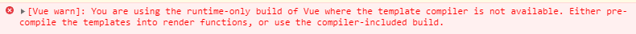

> **使用`import`引入模块时的原理：**
> 1. 项目根目录下查找`node_modules`目录；
> 2. `node_modules`目录下查找`from`后以字符串值为名的目录，比如：`vue`；
> 3. 该目录则为引入模块的根目录，在该目录下查找`package.json`，并查找名为`main`的配置项；
> 4. `main`配置项的值即导入的依赖包。

> **注意：**以上仅为存在`node_modules`目录的情况。

综上所述，查看`vue`模块根目录下`package.json`中配置项`main`的值：

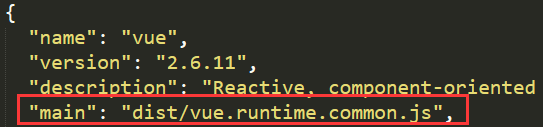

对比`vue.runtime.common.js`与`vue.js`文件大小：

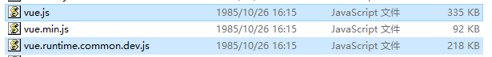

> **注意：**截图所示`vue.runtime.common.dev.js`为开发环境下的`vue.runtime.common.js`依赖包

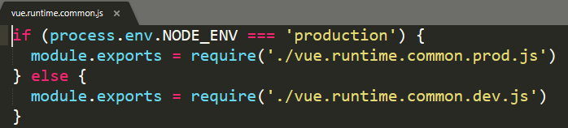

**重点：**`webpack`中使用`import Vue from 'vue'`引入`vue`依赖包时，引入的`vue.runtime.common.js`并非完整的`vue`，导致了上述的报错。

**解决方法：**
1. 修改配置文件`package.json`：`"main": "dist/vue.js"`；
2. 引入模块时使用完整路径：`import Vue from '../node_modules/vue/dist/vue.js'`；
3. `webpack.config.js`添加别名配置。**（推荐）**

上述第三种解决方式的详细配置如下：
```
resolve: {
	alias: {
		vue$: 'vue/dist/vue.js'
	}
}
```
> + `resolve`与`entry`同级；
> + `vue$`为正则，精确匹配`import * from 'xx'`引入时的`xx`值，必须以`vue`结尾才能匹配

### vue-loader

当使用`.vue`文件进行组件开发时，就需要引入`vue-loader`

+ 安装

`npm i vue-template-compiler vue-loader -D`

> **注意：**`vue-template-compiler`为`vue-loader`的内部依赖

+ 配置

修改配置文件：`webpack.config.js`

```js
const { VueLoaderPlugin } = require('vue-loader')
//或
//const VueLoaderPlugin = require('vue-loader/lib/plugin')

//......
module.exports = {
	//......
	module: {
		rules: [
			{
				test: /\.vue$/,
				use: 'vue-loader'
			}
		]
	},
	plugins: [
		new VueLoaderPlugin()
	]
}
```

> **注意：**`VueLoaderPlugin`这个插件是***必须的***，它的职责是将你定义过的其它规则复制并应用到`.vue`文件里相应语言的块。例如，如果你有一条匹配`/\.js$/`的规则，那么它会应用到`.vue`文件里的`<script>`块。

+ 使用

```js
import login from './login.vue'

var vm = new Vue({
  el: '#app',
  data: {
    msg: '111'
  },
  // render: function(createElement) {
  //   return createElement(login)
  // }
  components: {
    login
  }
})
```
页面如何使用子组件见`vue`部分，此处不再赘述。

详见：[Vue Loader API](https://vue-loader.vuejs.org/zh/)


# ES6

## class 类

+ class的本质是`function`

+ class可以看做是构造函数的另一种实现

+ 类也具备构造函数的特点：
 - 构造函数有原型对象`prototype`
 - 构造函数原型对象`prototype`有`constructor`指向构造函数本身
 - 构造函数可以通过原型对象添加方法
 - 构造函数创建的实例对象有`__proto__`指向构造函数的原型对象

## Promise